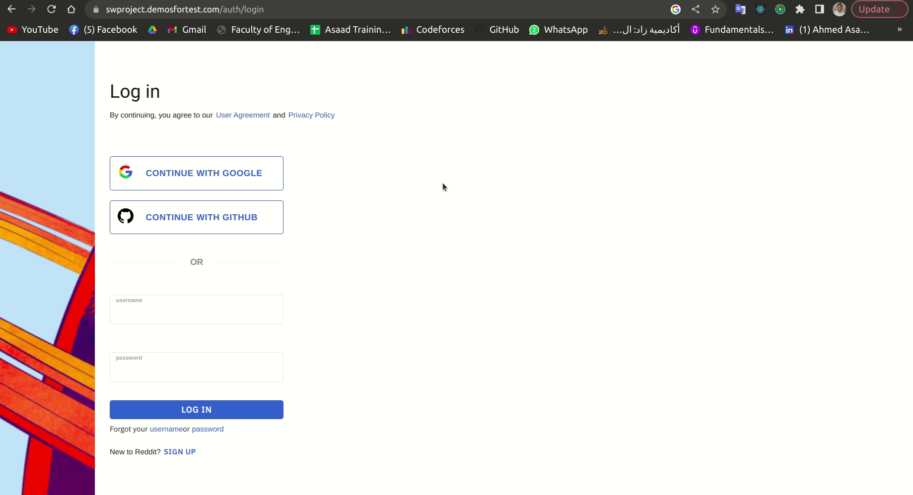

<header style="display: flex; flex-direction: column; align-items: center; justify-content: center; border-bottom: 1px solid white;margin-bottom: 35px">
<h1 style="text-align: center; font-weight:700"> RedditXClone </h1>

    

</header>

    <h1 style="font-weight:700;">Introduction</h1>
      
This is our whole clone for <a href="https://swproject.demosfortest.com/">Reddit </a>social media website. This work starts in October 20022.

      
    

    <h1 style="font-weight:700;">Technologies</h1>
      <ul>
        <li style="font-size: 15px;"><a href="https://reactjs.org/">React v18.2.0</a></li>
        <li style="font-size: 15px;"><a href="https://mui.com/">Material UI</a> for existing components and some animations.</li>
        <li style="font-size: 15px;"><a href="https://react-icons.github.io/react-icons/search">React-icons</a> Library for icons as components</li>
        <li style="font-size: 15px;"><a href="https://redux-toolkit.js.org/">Redux-Toolkit</a> For saving every thing related to the current user</li>
        <li style="font-size: 15px;"><a href="https://draftjs.org/">Draft-js</a> For creating a post editor</li>
        <li><a href="https://www.npmjs.com/package/draft-js-export-markdown">draft-js-export-markdown</a> For converting the editor state to markdown text</li>
        <li><a href="https://www.npmjs.com/package/draft-js-import-markdown">draft-js-import-markdown</a> For converting the readme text to the  state to markdown text</li>
         <li><a href="https://www.npmjs.com/package/react-google-login">React-Google-login</a> For continue with Google feature</li>
        <li><a href="https://jsdoc.app/">JsDoc</a> For functional documentation</li>
      </ul>
      
    

    <h1 style="font-weight:700;">Features</h1>
      <ul>
        <li style="font-size: 15px;">Login</li>
      <li style="font-size: 15px;">Sign Up</li>
      <li style="font-size: 15px;">Forget username</li>
      <li style="font-size: 15px;">Forget userpassowrd</li>
      <li style="font-size: 15px;">Continue with Google</li>
      <li style="font-size: 15px;">Home Page</li>
      <li style="font-size: 15px;">Subreddit Page</li>
      <li style="font-size: 15px;">Search</li>
      <li style="font-size: 15px;">Create Post</li>
      <li style="font-size: 15px;">Create subreddit</li>
      <li style="font-size: 15px;">Post full page</li>
      <li style="font-size: 15px;">send private message</li>
      </ul>
    

    <h1 style="font-weight:700;">Installation</h1>
    

        Start with the packages put in packages.json, then run the following command. 
        <code>npm i</code>
        

            if you faced a problem with the previous command try using legacy or force
        

    

      

    <h1 style="font-weight:700;">Installation</h1>
    

        Start with the packages put in packages.json, then run the following command. 
        <code>npm i</code>
        

            if you faced a problem with the previous command try using legacy or force
        

    

      

    <h1 style="font-weight:700;">Show Case</h1>
      <ul>
        <li style="font-size: 15px;">
            <h3>Home page</h3>
             
        </li>
        <li style="font-size: 15px;">
            <h3>Login</h3>
             
        </li>
        <li style="font-size: 15px;">
            <h3>Sign Up</h3>
        
        </li>
        <li style="font-size: 15px;">
            <h3>Continue With Google</h3>
        
        </li>
        <li style="font-size: 15px;">
            <h3>Create subreddit and subreddit page</h3>
            
        </li>
        <li style="font-size: 15px;">
            <h3>Create text Post and Post Page</h3>
            
        </li>
        <li style="font-size: 15px;">
            <h3>Create Post with images and Post Page</h3>
            
        </li>
        <li style="font-size: 15px;">
            <h3>Search</h3>
            
        </li>
        <li style="font-size: 15px;">
            <h3>Send private message</h3>
            
        </li>
      </ul>
      
    

    <h1 style="font-weight:700;">Future Features</h1>
    <ul>
        <li style="font-size: 15px;">Profile Page</li>
      <li style="font-size: 15px;">Notifications</li>
      <li style="font-size: 15px;">Messages</li>
      <li style="font-size: 15px;">Moderation tools</li>
    </ul>
      

