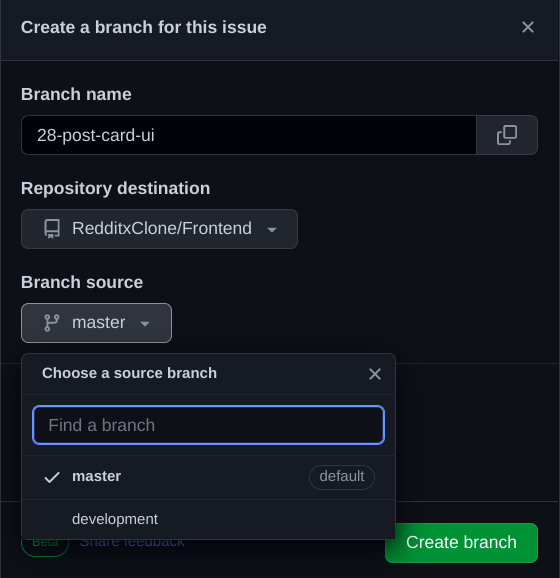

# Important Notes

- Work only on the developement branch, create the branches from the developement branch
  **Example**:

  **mark the developement, not the master**

- Do not forget Testing and put the testing code in the testing directory

- For the pages put the code in the pages directory

- For the reusable and repeated components, put the code in utilities
